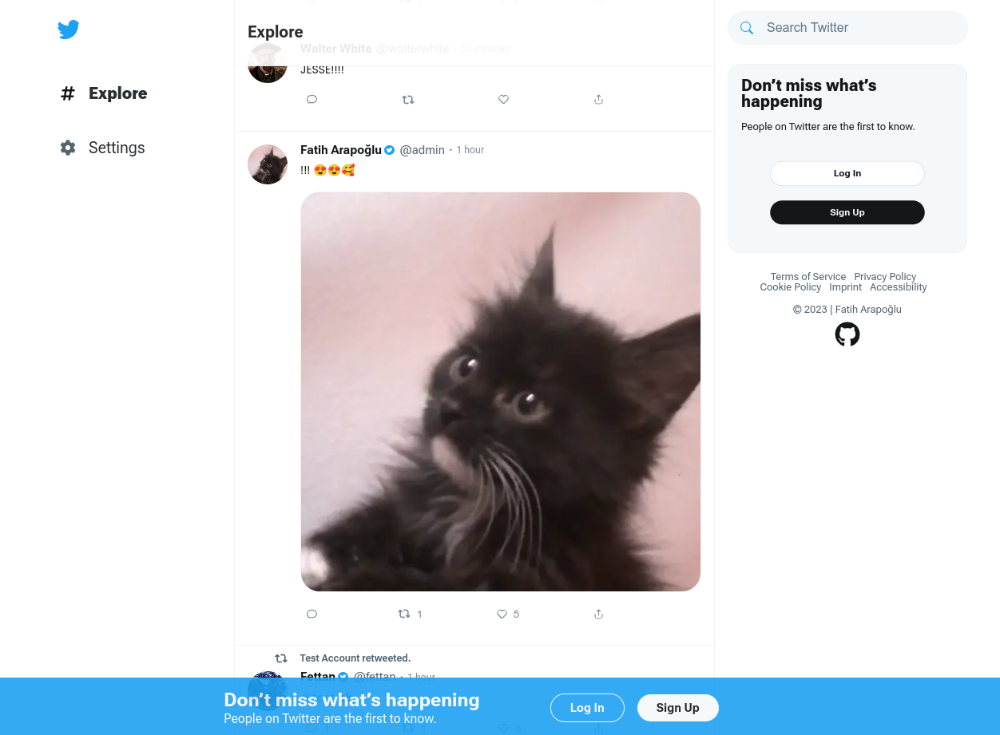
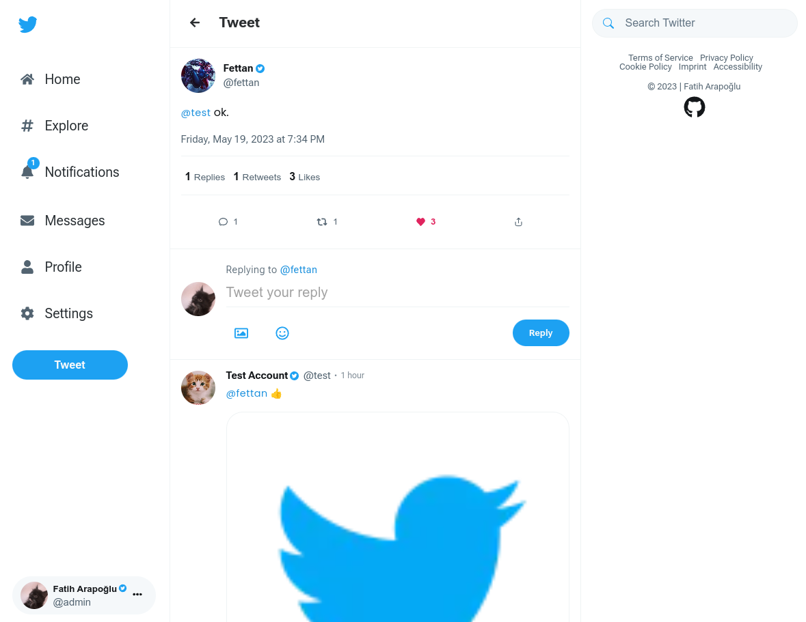
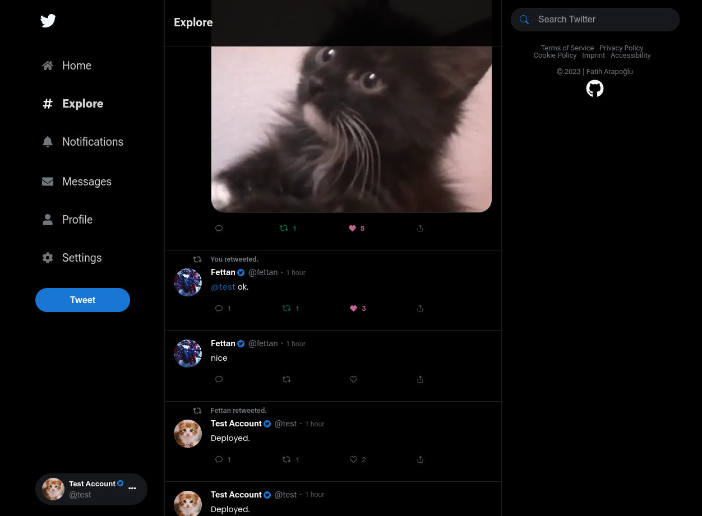
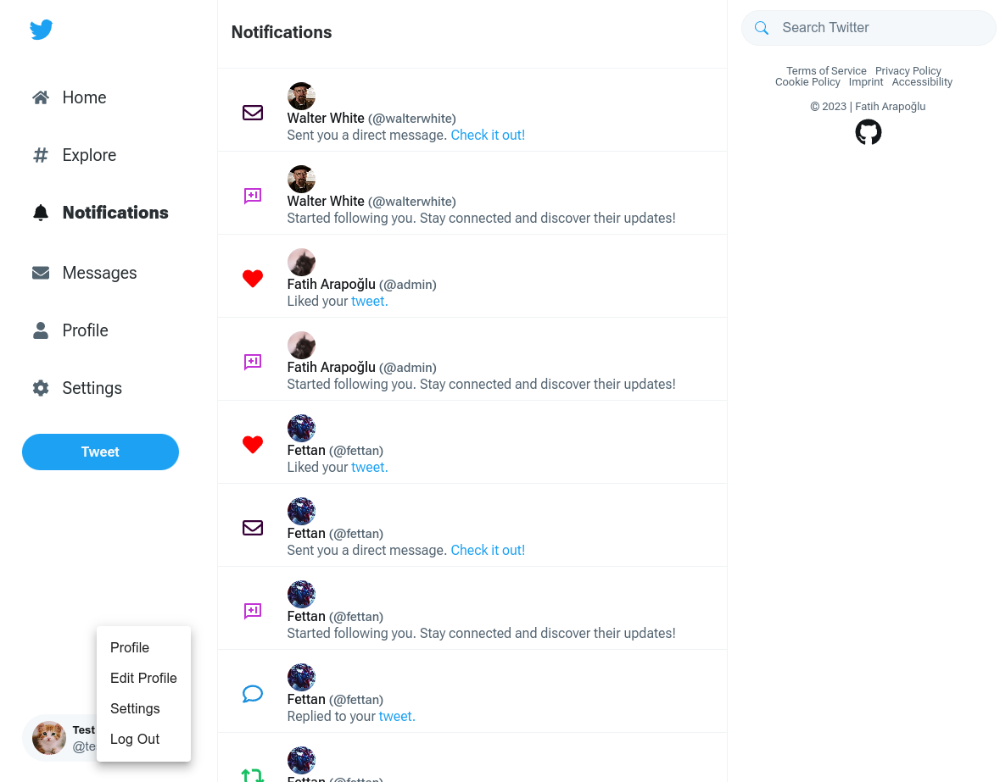
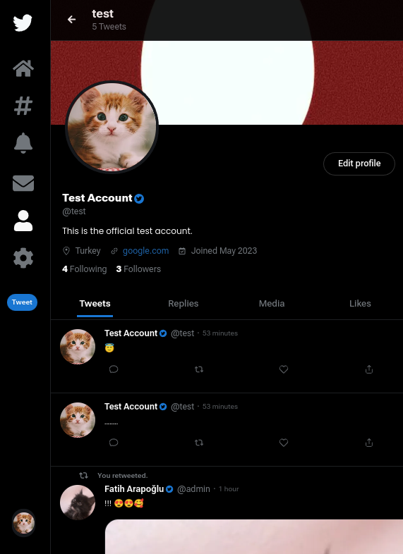
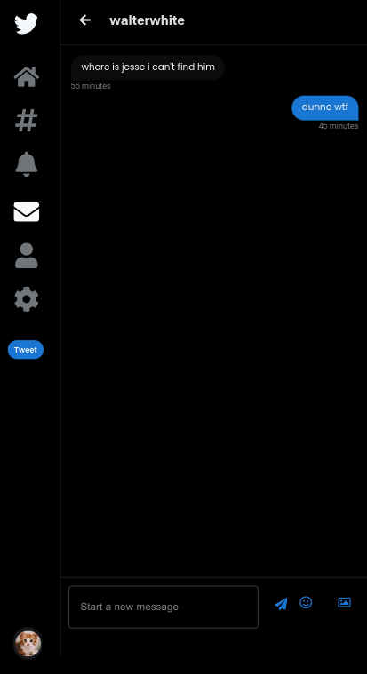

# Twitter Clone (Full-stack Next.js 13+)

Introducing a comprehensive clone of [Vicsory](https://twitter.com), with a familiar interface and a range of essential features.

Created with **Next.js 13+**, **Supabase** and **PostgreSQL**. Deployed on [**Vercel**](https://vercel.com/).

<!-- ## ⮕ [Live preview](https://twitter.fatiharapoglu.com.tr) -->

### ➡ FYI: Supabase updated their DB settings recently (January 2024), so environment variables from examples may look different when you try it out.

---

`Secret key for Twitter Blue: thanksforcaring`

---

## Features

-   **Profiles**: Users can create their own profiles, add a profile picture, and customize their bio to express their personality and interests.
-   **Posts and Replies**: Just like Twitter, users can compose and share posts of up to a certain character limit, allowing them to share their thoughts, ideas, or any other content with their followers.
-   **Following/Followers**: Users can follow other users to see their posts on their timeline and gain followers who are interested in their content.
-   **Likes/Reposts**: Users can engage with posts by liking them to show appreciation or reposting them to share them with their own followers. Also undo reposts and unlike support.
-   **Notifications**: Users receive notifications when someone likes or reposts their posts, when they gain new followers, or when they are mentioned in a post by another user.
-   **Search**: Users can search for specific posts or accounts to find relevant content or connect with specific users.
-   **Direct Messaging**: Users can send private messages to other users, allowing for one-on-one conversations and interactions.
-   **Twitter Blue**: Users can get premium status by entering a secret code, getting an icon with their name.
-   **Emoji Support**: Users can easily add emojis to their posts and replies, enhancing expression and engagement.
-   **User Authentication and Security**: Custom user authentication with hooks, bcrypt, JWT. Access control, ensuring secure login and protected user data.
-   **Real-time Data Fetching**: Implement real-time updates with react-query, allowing users to see new posts, likes, and reposts without manually refreshing the page.
-   **Image Support**: Users can upload images with their posts, replies, profile and header pictures and direct messages, enhancing visual content sharing.
-   **Infinite Scroll**: Infinite scrolling, providing a seamless browsing experience for users as they explore their timeline.
-   **Date and Time Formatting**: Formatting timestamps and display them in a user-friendly manner, such as relative time (e.g., "5 minutes ago").
-   **Deleting**: Users can delete their own posts, replies and reposts. Also unlike posts.
-   Dark and Light mode.
-   Optimistic updates on likes, reposts, followings and so on.
-   Full-Stack Next.js (13+) App directory advantages.
-   Responsive design.

## Helper Dependencies

-   [Prisma](https://www.prisma.io/) for database access and manipulation.
-   [Supabase JS Client](https://supabase.io/) for interacting with the storage.
-   [Material UI](https://mui.com/) production ready components UI library.
-   [TypeScript](https://www.typescriptlang.org/) for types.
-   [React Query](https://react-query.tanstack.com/) hooks and utilities for data fetching and state management.
-   [Emoji Mart](https://missiveapp.com/open/emoji-mart) for Emoji picker and rendering components in React.
-   [Bcrypt](https://www.npmjs.com/package/bcrypt) password hashing and encryption functionality.
-   [Date-fns](https://date-fns.org/) utility functions for date manipulation and formatting.
-   [Framer Motion](https://www.framer.com/motion/) animation components and utilities.
-   [Formik](https://formik.org/) form management utilities.
-   [Yup](https://www.npmjs.com/package/yup) for form validation schemas.
-   [React Dropzone](https://react-dropzone.js.org/) drag-and-drop file upload component for React.
-   [react-icons](https://react-icons.github.io/react-icons/) collection of customizable icons.
-   [react-infinite-scroll-component](https://www.npmjs.com/package/react-infinite-scroll-component) for infinite scrolling.
-   [Jose](https://www.npmjs.com/package/jose) for handling JWTs.
-   [Eslint](https://eslint.org/) for linting.
-   [Prettier](https://prettier.io/) for formatting.
-   [Sass](https://sass-lang.com/) for SCSS

## Roadmap

### ⮕ You can access the complete progression of development from [changelog.md file](/CHANGELOG.md).

-   [x] Only verified blue tick user should show in the who to follow section.
-   [ ] Add block/unblock feature.
-   [ ] Add hidden/locked profile.
-   [ ] Find out how to infinite load for every page / extract usememo to the different component? because can't conditionaly render.
-   [ ] Find a better way of optimistic messages other than faking it, refactor whole messaging system.
-   [ ] Add Turkish language support.
-   [ ] Multiple test accounts when onclick test login, test account goes to random.
-   [ ] Email / sms verification just for the fun.

## Acknowledgements

-   [Google Fonts](https://fonts.google.com/) (Poppins and Roboto fonts provider)

## How It Looks

## Contact

⮕ [LinkedIn](https://www.linkedin.com/in/fatiharapoglu/)

⮕ [Portfolio](https://fatiharapoglu.com.tr)

## License

Distributed under the [MIT](https://choosealicense.com/licenses/mit/) License.
